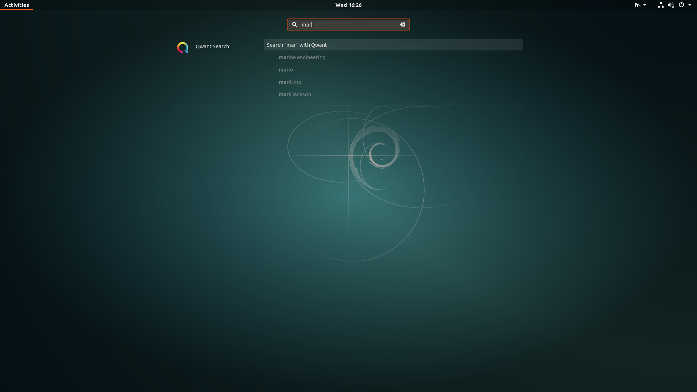

# Qwant-Gnome-shell-integration
A Gnome-shell extension to be able to search Qwant directly from the overview (Only for Gnome 3.26.2)

Install : https://extensions.gnome.org/extension/1389/qwant-search/

# Features :
 - Get suggestions and search Qwant directly from the Overview.
 - Use keywords to directly search for results (configure in settings) [Work in Progress]
 - Special suggestions and Qwicks (access or search directly from websites using "&")
 - Adds a button to the top panel to launch Qwant directly (remove via settings)
 - Select search category in extension settings

Screenshot :


# To come:
 - More settings, such as max number of suggestions
 - If you have other ideas, open an issue : https://github.com/al34034/Qwant-Gnome-shell-integration/issues/new
 
 # How to install :
 **Easy install (via extensions.gnome.org) :** https://extensions.gnome.org/extension/1389/qwant-search/
 
*Or*

 Warning : **Please check your Gnome-shell version is 3.26.2** (Settings > Details > About > Gnome)
 ```
 git clone https://github.com/al34034/Qwant-Gnome-shell-integration/ /tmp/qwant_gnome/
 mkdir -p ~/.local/share/gnome-shell/extensions/
 cp -R /tmp/qwant_gnome/Qwant_search@alex.nitters.eu/ ~/.local/share/gnome-shell/extensions/Qwant_search@alex.nitters.eu/
 rm -rf /tmp/qwant_gnome/
 gnome-shell-extension-tool -e Qwant_search@alex.nitters.eu
 ```
 Restart gnome-shell : Alt+F2 and type "r" or logout/login.
 
 # Settings :
 
 Use the Tweaks application and navigate to Extensions > Qwant Search > Settings icon
 
 *Or* 
 
 Run `gnome-shell-extension-prefs` and look for Qwant search
 
 Settings : panel button and search category
 
 # Uninstall :
 Disable via Tweaks or extensions.gnome.org.
 
 *Or*
 
 ```
 gnome-shell-extension-tool -d Qwant_search@alex.nitters.eu
 rm -rf ~/.local/share/gnome-shell/extensions/Qwant_search@alex.nitters.eu/
 ```
 Restart gnome-shell : Alt+F2 and type "r" or logout/login.
 

\**Note : This extension will only be published for Gnome 3.26 and above. You can try and port it to older versions, but the results will look ugly.*
