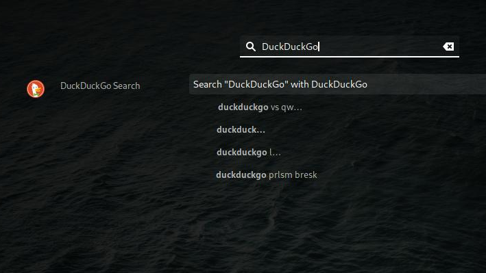

# Qwant-Gnome-shell-integration
A Gnome-shell extension to be able to search DuckDuckGo directly from the overview

Install : https://extensions.gnome.org/extension/1389/qwant-search/

this is a fork of [al34034](https://github.com/al34034/Qwant-Gnome-shell-integration)'s projec)'s project, based on qwant search enginge

# Features :
 - Search DuckDuckGo directly from the Overview with any web browser you like! this way you are not constrained to Epiphany search from the Overview
 - Qwant API powered suggestions (that's from [al34034](https://github.com/al34034/Qwant-Gnome-shell-integration) fork)
 - !bangs are working good

Screenshot :


 # How to install :
 **Easy install (via extensions.gnome.org) :** https://extensions.gnome.org/extension/1389/qwant-search/ ,or

 ```
 git clone https://github.com/al34034/Qwant-Gnome-shell-integration/ /tmp/qwant_gnome/
 mkdir -p ~/.local/share/gnome-shell/extensions/
 cp -R /tmp/qwant_gnome/Qwant_search@alex.nitters.eu/ ~/.local/share/gnome-shell/extensions/Qwant_search@alex.nitters.eu/
 rm -rf /tmp/qwant_gnome/
 gnome-shell-extension-tool -e Qwant_search@alex.nitters.eu
```

Restart gnome-shell : Alt+F2 and type "r" or logout/login.

 # Uninstall :

Disable via Tweaks or https://extensions.gnome.org/ or

Delete the folder you've cloned
